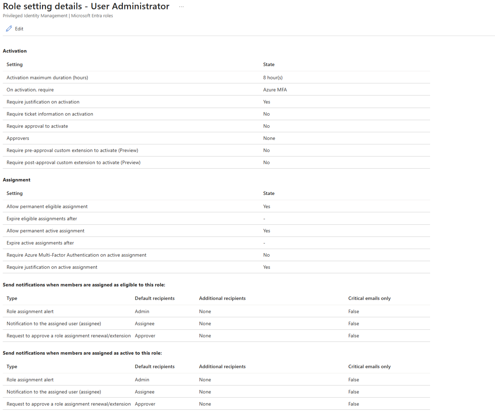
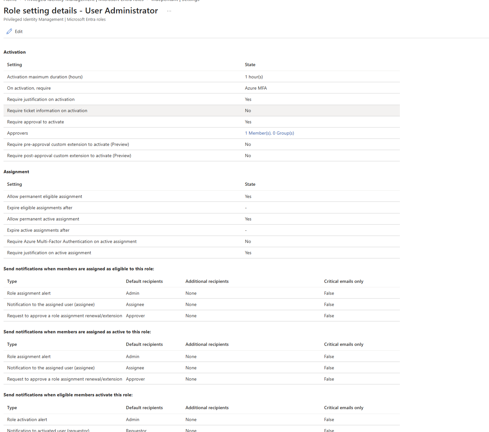
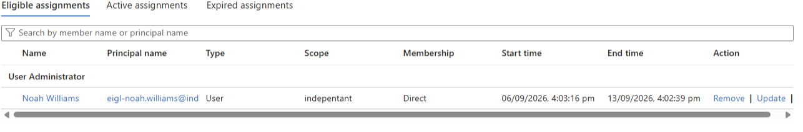
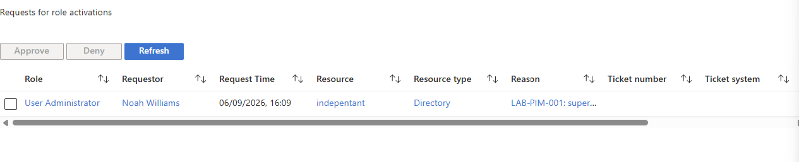
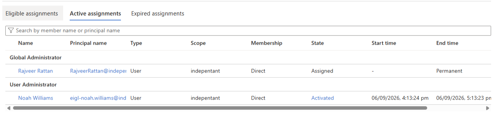

# Enterprise Identity Governance Lab

A small, plan-first Microsoft Entra identity administration lab for demonstrating joiner, mover and leaver (JML) controls, group-based access, least privilege, Privileged Identity Management (PIM), access reviews and defensible automation decisions.

Status: **live joiner/mover/leaver automation and a supervised PIM activation are verified.** The lifecycle run completed 17 operations with fresh Graph readback. Noah later received time-bound User Administrator eligibility and a one-hour activation governed by MFA, justification and Maya's approval. Access-review execution remains pending. Checked-in configuration and local test fixtures are synthetic; separately labelled tenant evidence contains the real observations.

A [5 September follow-up](evidence/tenant/2026-09-05/README.md) confirms all six users still match the lifecycle result, adds 25 service-side audit records from the original change window, and verifies Maya as Finance's owner. The access-review execution remains pending.

The [6 September PIM evidence](evidence/tenant/2026-09-06/README.md) records the original and updated User Administrator settings, Noah's seven-day eligibility, the activation request visible to Maya and the resulting one-hour active assignment. Automatic expiry or manual deactivation was not captured and is not claimed.

## What the demonstration shows

- A fictional organisation, Northstar Analytics, with six employees, reporting lines, three departments and an explicit access matrix.
- Deterministic reconciliation: desired HR-style CSV input + observed state -> a schema-2 change plan whose versioned checksum covers tenant, mode, operations and dependencies.
- Joiners receive a cloud identity and only baseline, department and manager groups.
- Movers lose obsolete lab-managed access before new access is granted.
- Leavers are disabled, have sessions revoked, and lose only access this lab owns; identities are retained for audit/recovery.
- Emergency-access and non-lab accounts fail closed. Conditional Access remains owned by the separate Zero Trust lab.
- Graph operations are behind tenant, scope, confirmation and plan-integrity gates.
- A supervised PIM exercise replaces standing User Administrator access with time-bound eligibility, MFA, justification, approval and a one-hour activation window.

## Live PIM result

The original User Administrator policy allowed an eight-hour activation and did not require approval:



The reviewed policy reduced activation to one hour and required MFA, justification and an approver:



Noah was made directly eligible for seven days:



Maya could see Noah's justified activation request:



The resulting assignment was active for a one-hour window:



## Architecture

```text
employees.csv + organisation.json + observed state
                    |
                    v
          pure PowerShell planner
                    |
          preview JSON (default)
                    |
       explicit gated apply (reviewed plan)
                    |
            Microsoft Graph v1.0
```

The core planner in `src/` has no cloud dependency. `scripts/` contains entry points; `config/` contains synthetic desired/observed data; `docs/` explains controls and portal exercises; `evidence/` separates synthetic examples from redacted live tenant evidence; and `learning/` maps the work to SC-300.

## Quick start

Windows PowerShell 5.1 or PowerShell 7 can run the local workflow:

```powershell
./scripts/Invoke-Tests.ps1
./scripts/New-LabPlan.ps1
./scripts/Test-LabState.ps1 -CurrentStatePath ./config/converged-state.example.json
```

The preview proposes 17 operations: two joiners, one department mover and one leaver. The verification command returns compliant for the converged synthetic state. Generated runs go to ignored `evidence/runs/`; they are not real evidence.

The lifecycle regression suite contains 32 tests, with four additional governance-readiness export tests. Graph export tests use mocked response/error objects, including pagination; they do not claim real tenant compatibility.

Do not run the apply entry point until the tenant prerequisites and safety checklist in [setup](docs/setup.md) are complete. The checked-in configuration has `allowMutation: false`, placeholder IDs and cannot pass the apply gates.

## Guided tour

1. [Scenarios and demo narrative](docs/scenarios.md)
2. [Access matrix](docs/access-matrix.md)
3. [Security and design decisions](docs/design-decisions.md)
4. [Graph permissions and prerequisites](docs/permissions.md)
5. [Lifecycle runbook](docs/runbooks/lifecycle.md)
6. [PIM runbook](docs/runbooks/pim-activation.md)
7. [Access review runbook](docs/runbooks/access-review.md)
8. [Evidence index](evidence/README.md) and [completion checklist](docs/completion-checklist.md)
9. [SC-300 mapping](learning/sc-300-mapping.md)

## Interview walkthrough

1. Show the access matrix and explain the joiner, mover and leaver triggers.
2. Open the live before/after table: Liam's department move, Sofia's disablement and the two joiners.
3. Show the execution journal alongside the service-side audit and later state readback.
4. Explain removal-before-addition dependencies, partial failures and why a revocation request is not proof that every application session ended.
5. Show the PIM policy before and after, the eligible assignment, approval request and one-hour active result. Describe post-expiry verification and access-review execution as remaining work.

## Ownership boundary

This repository owns ordinary lab users, its prefixed security groups and their direct memberships. It exports a non-secret example integration manifest at `config/zero-trust-integration-manifest.example.json`. The Zero Trust Identity & Conditional Access Lab owns Conditional Access and emergency-access exclusions. This repository neither creates nor changes Conditional Access policies.

## Safety summary

Planning is always local and read-only. Applying requires a separately created ignored config, `allowMutation: true`, an explicit `-ConfirmTenantMutation`, a matching Graph tenant context, an intact plan hash, UPN prefix/domain checks, a protected-UPN denylist and a managed-group-ID allowlist. Cleanup deprovisions; it does not delete identities or groups.
